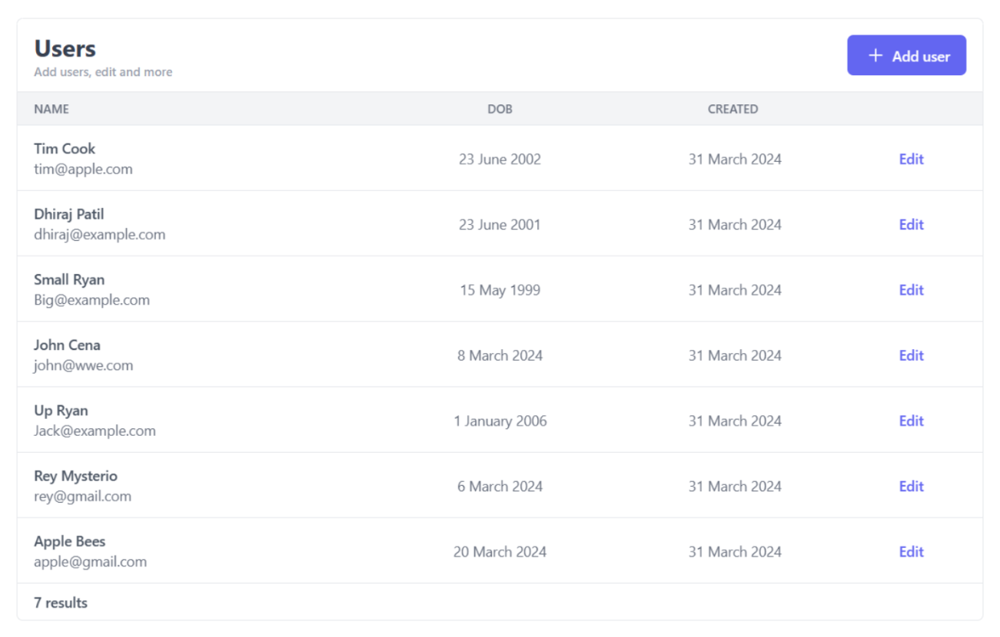
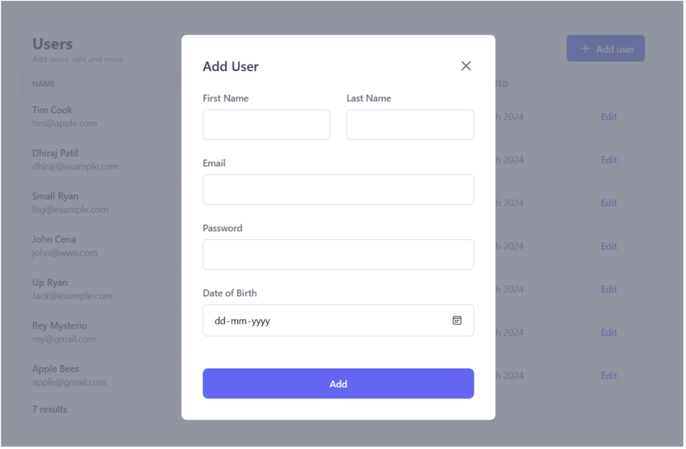

# User Management App
Fullstack developer test project - GOQII

## Features
- Create, Read, Update and Delete user records
- Setup with Postgres database

## API Endpoints
- Base URL - http://localhost:3001/api

- Get user list - GET /users
- Get particular user record - GET /users/:id
- Create new user list - POST /users
- Update existing user - PUT /users/:id
- Delete user record - DELETE /users/:id

## Installation
**Clone the Repo**

    $ git clone https://github.com/Dhirajjjj/user_management_app.git
    $ cd user-management

### Frontend  Setup 
**install the required dependencies**

    $ cd frontend
    $ npm init

(used dependencies)

    $ npm install tailwind
    $ npm install axios

start project using (optionally using nodemon)

    $ npm start

Open http://localhost:3000 to view the app

### Backend  Setup 
The Backend provides a REST API endpoint server to fetch user data using the express app.

**install the required dependencies**

    $ cd backend
    $ npm init

(used dependencies)

    $ npm install express
    $ npm install pg
    $ npm install sequelize
    $ npm install bcrypt

start project using (optionally using nodemon)

    $ npm start

you can test the end-points by hitting http://localhost:3001 using postman

**(if using any other $PORT perform necessary changes in middleware for cors)**

### Database Setup
For database PostgreSQL is used

> Download Postgres from here - https://www.enterprisedb.com/downloads/postgres-postgresql-downloads

**Postgres Setup**
- Setup with user and password
- Run database on post 5432
- update database variables in **backend/config/database**

Setup postgres with the provided schema

    $ createdb Users
    $ psql -f schema.sql Users

(make sure the database is properly setup) 

**Now you are good to go!**

## Personal Decisions

> This was made in a **shortcut** kind of way, skipping the understanding of lots of additional features such as
> - who should be able to update records 
> - who and how can one create records
> - would updation of records require verified password
> - ability to change passwords
>
> for the simplicity of showcasing the working app with the following technologies and within the respective time.

### Packages selection
**Frontend**

    Axios - for handling network http requestes

    Tailwind css - styling library 

**Backend**

    sequelize - for object-relational mapping

    pg - for interacting with the postgresql database

    bcrypt - for hashing the user passwords before storing them in the database

### Future Scope
 
- [x] Search user record based on name
- [ ] Allow user record update only after verifying password 
- [ ] Admin functionality to enable/disable user record

## Images

